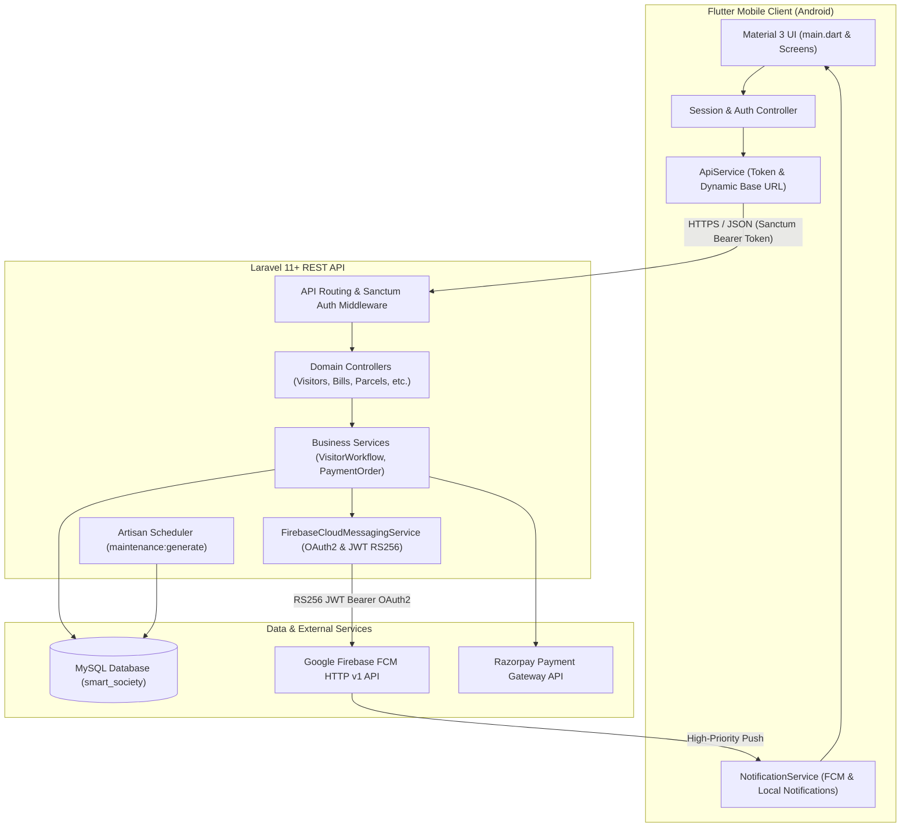
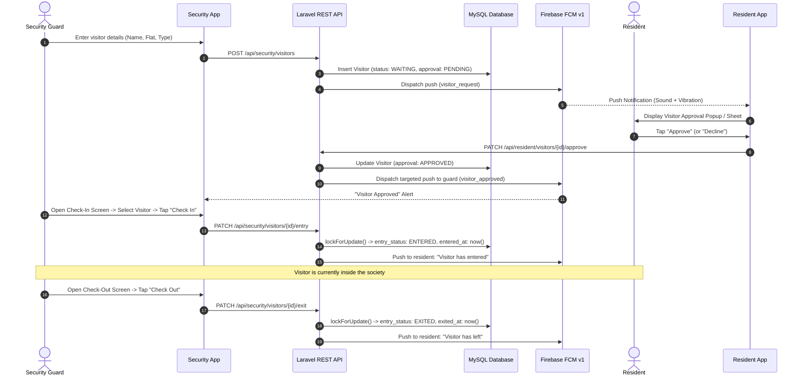
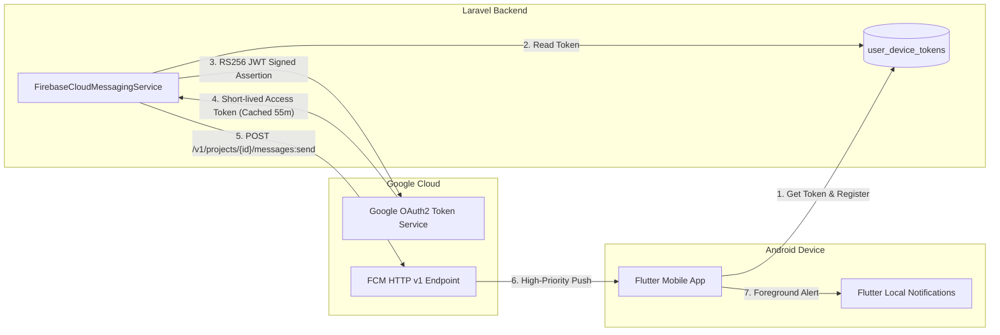
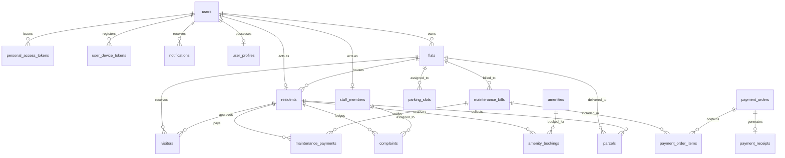

# Smart Society Management System

[](https://laravel.com)
[](https://flutter.dev)
[](https://php.net)
[](https://mysql.com)
[](https://firebase.google.com)
[](LICENSE)

> A centralized, real-time residential society management platform connecting Residents, Security Personnel, and Society Administrators through a cross-platform Flutter mobile client and a high-performance Laravel REST API.

---

## Table of Contents

1. [Project Overview](#project-overview)
2. [Problems Solved](#problems-solved)
3. [System Architecture](#system-architecture)
4. [Technology Stack](#technology-stack)
5. [User Roles and Permissions](#user-roles-and-permissions)
6. [Core Feature Modules](#core-feature-modules)
   - [Visitor Management and Gate Operations](#1-visitor-management-and-gate-operations)
   - [Parcel Tracking and Collection](#2-parcel-tracking-and-collection)
   - [Maintenance Billing and Invoicing](#3-maintenance-billing-and-invoicing)
   - [Payment Processing and Reconciliation](#4-payment-processing-and-reconciliation)
   - [Helpdesk and Complaint Management](#5-helpdesk-and-complaint-management)
   - [Digital Notice Board](#6-digital-notice-board)
   - [Parking Slot Management](#7-parking-slot-management)
   - [Facility and Amenity Bookings](#8-facility-and-amenity-bookings)
   - [Internal Messaging and Conversations](#9-internal-messaging-and-conversations)
7. [Notification Architecture (Firebase FCM HTTP v1)](#notification-architecture-firebase-fcm-http-v1)
8. [Database Schema and Relationships](#database-schema-and-relationships)
9. [REST API Documentation](#rest-api-documentation)
10. [Flutter Mobile Architecture](#flutter-mobile-architecture)
11. [Local Development Setup](#local-development-setup)
12. [Physical Device and Network Configuration](#physical-device-and-network-configuration)
13. [Testing and Verification](#testing-and-verification)
14. [Current Implementation Status](#current-implementation-status)
15. [Production Deployment Guide](#production-deployment-guide)
16. [Security and Best Practices](#security-and-best-practices)
17. [Troubleshooting Guide](#troubleshooting-guide)
18. [Future Roadmap](#future-roadmap)
19. [Repository Structure](#repository-structure)

---

## Project Overview

**Smart Society Management System** modernizes residential gated community workflows. Traditional housing societies rely on manual paper registers at the security gate, phone calls for visitor approvals, cash or untracked bank transfers for maintenance dues, paper notice boards, and unorganized complaint resolution.

Smart Society unifies all these touchpoints into a unified digital ecosystem:
- **Security guards** record gate entries, check visitor approvals in real-time, log parcels, and manage vehicle movement.
- **Residents** receive immediate push notifications with sound/vibration alerts to approve or decline visitors, pay monthly maintenance bills, download itemized PDF receipts in Indian Rupees (`₹`), raise complaints, and book amenities.
- **Administrators** monitor society finances, track overdue balances, generate automated billing runs, publish targeted notices, and oversee society assets.
- **Staff members** receive assigned maintenance tasks and update job tickets directly.

---

## Problems Solved

| Traditional Society Bottlenecks | Smart Society Solution |
| :--- | :--- |
| Paper registers at gates easily forged, lost, or illegible | Digital check-in with timestamped records, vehicle numbers, and photos |
| Gate guards making repeated phone calls to residents for entry clearance | Immediate Firebase push notification sent directly to resident's smartphone |
| Lack of audit trails for when visitors enter or leave | Strict state machine with database locking preventing duplicate entries or exits |
| Scattered maintenance receipts and unclear dues | Automated monthly billing engine, ledger tracking, and instant PDF invoices |
| Lost deliveries and uncollected packages at security | Parcel logging with resident association and signature-style collection tracking |
| Unresolved resident complaints and lack of status visibility | Multi-tier ticketing system with priority levels, staff assignment, and status histories |

---

## System Architecture

The project follows a decoupled client-server architecture with asynchronous cloud push dispatch:



---

## Technology Stack

### Backend
- **Framework:** [Laravel](https://laravel.com/) `^11.0` / `^13.8` (PHP 8.3+)
- **Authentication:** [Laravel Sanctum](https://laravel.com/docs/sanctum) `^4.3` (Stateful Bearer Token API Authentication)
- **Database ORM:** Eloquent ORM with strict type casting and foreign key cascades
- **Background Tasks:** Artisan Console & Schedulers (`routes/console.php`)
- **Testing:** [PHPUnit](https://phpunit.de/) `^12.5.12` & [Mockery](https://github.com/mockery/mockery) `^1.6`
- **Push Engine:** Native Google OAuth2 RS256 JWT service targeting Firebase Cloud Messaging HTTP v1 (`/v1/projects/{project_id}/messages:send`)

### Frontend (Mobile)
- **Framework:** [Flutter](https://flutter.dev/) (Dart SDK `>=3.4.0 <4.0.0`)
- **UI Architecture:** Material 3 with role-based adaptive navigation shells
- **State Management:** Provider `^6.1.2` with custom `AuthController`
- **Secure Storage:** `flutter_secure_storage: ^9.2.2` (Encrypted token persistence)
- **Networking:** `http: ^1.2.2` with dynamic network diagnostic logging
- **Push & Alerts:** `firebase_core: ^4.15.0`, `firebase_messaging: ^16.7.0`, `flutter_local_notifications: ^22.3.1`
- **Document Generation:** `pdf: ^3.11.1`, `printing: ^5.13.2` with embedded UTF-8 font support for the Indian Rupee symbol (`₹`)
- **Payment SDK:** `razorpay_flutter: ^1.3.7`

### Database & Infrastructure
- **RDBMS:** MySQL 8.0 / MariaDB (InnoDB, UTF8mb4)
- **Local Dev Server:** PHP Built-in Server / XAMPP Apache & MySQL
- **Production Target:** Web / Cloud Hosting (e.g. Hostinger, VPS) with Nginx/Apache and SSL

---

## User Roles and Permissions

Smart Society implements strict Role-Based Access Control (RBAC) enforced at both the API routing layer (`role:ROLE_NAME` middleware) and within Eloquent authorization policies.

```
       ┌────────────────────────────────────────────────────────┐
       │                       User (Base)                      │
       └────────────────────────────────────────────────────────┘
                 ▲                  ▲                  ▲
                 │                  │                  │
        ┌────────┴────────┐ ┌───────┴────────┐ ┌───────┴────────┐
        │    RESIDENT     │ │    SECURITY    │ │     ADMIN      │
        └─────────────────┘ └────────────────┘ └────────────────┘
                 │
        ┌────────┴────────┐
        │      STAFF      │
        └─────────────────┘
```

### 1. `RESIDENT`
- **Target Audience:** Apartment owners and tenants residing in society flats.
- **Access Scope:** Scoped strictly to the resident's assigned flat (`flat_id`).
- **Permissions:**
  - View real-time visitor requests; approve or decline visitor entries.
  - Create pre-approved visitor passes for expected guests.
  - View itemized monthly maintenance invoices, outstanding balances, and payment receipts.
  - Execute digital payments via Razorpay or simulated test checkout.
  - Download official maintenance payment invoice PDFs.
  - Register society complaints (plumbing, electrical, security, etc.) and track progress.
  - View notices published to `ALL`, `RESIDENTS`, or `OWNERS`.
  - View allocated vehicle parking slots.
  - Reserve society amenities (Clubhouse, Gym, etc.).
  - Receive delivery parcels logged at the security gate.

### 2. `SECURITY`
- **Target Audience:** Security guards stationed at gates and access checkpoints.
- **Permissions:**
  - Create gate visitor check-in requests for arriving guests, cabs, and delivery agents.
  - Receive targeted notifications when a resident approves or rejects an entry request.
  - Dedicated **Check In** workflow: verify approved visitors and record timestamped entry.
  - Dedicated **Check Out** workflow: view all visitors currently inside and record exit.
  - Access historic checked-out logs with search by visitor name or mobile number.
  - Log incoming courier packages and parcels for flats.
  - View general society notices and emergency contact guidelines.

### 3. `ADMIN`
- **Target Audience:** Society Chairman, Secretary, Treasurer, or Property Managers.
- **Permissions:**
  - Full CRUD management of society flats, buildings, and resident records.
  - Generate society-wide monthly maintenance invoices with customizable fee structures.
  - View aggregate collection statistics, overdue amounts, and reconciliation ledgers.
  - Oversee all visitor logs, security gate performance, and vehicle entries.
  - Triage, assign, and update status on all resident complaints.
  - Compose, publish, schedule, or expire official society notices.
  - Manage society staff members, assign shift schedules, and manage parking slot allocations.
  - Create and configure bookable amenities (opening/closing hours, max booking duration).

### 4. `STAFF`
- **Target Audience:** Electricians, plumbers, sweepers, and maintenance contractors.
- **Permissions:**
  - View assigned service tickets and complaints.
  - Update complaint resolution status (`IN_PROGRESS`, `RESOLVED`).
  - View parcel deliveries and staff notices.

---

## Core Feature Modules

### 1. Visitor Management and Gate Operations

Visitor management is engineered as a robust state machine preventing unauthorized entries, double check-ins, or orphan records:



#### Status State Machine
- **Approval Status:** `PENDING` ➔ `APPROVED` or `REJECTED` ➔ `COMPLETED`
- **Entry Status:** `WAITING` (or `EXPECTED` if pre-approved) ➔ `ENTERED` ➔ `EXITED`

#### Concurrency and Security Guarantees
- `lockForUpdate()` is utilized during `recordEntry` and `recordExit` transactions.
- A visitor cannot be checked in unless `approval_status == 'APPROVED'` and `entered_at IS NULL`.
- A visitor cannot be checked out unless `entry_status == 'ENTERED'` and `exited_at IS NULL`.
- Approvals can only be executed by a verified resident linked to that specific flat.

---

### 2. Parcel Tracking and Collection

1. **Intake:** Security or Staff receives a courier delivery, navigates to **Log Parcel**, and selects the destination flat and resident.
2. **Details Captured:** Courier partner name (Amazon, Flipkart, BlueDart, etc.), tracking number, parcel category, and optional notes.
3. **Notification:** Stored with status `RECEIVED` / `AWAITING_PICKUP`, triggering an in-app alert to the resident.
4. **Collection:** When the resident arrives at the security desk to collect the parcel, security marks it collected via `PATCH /api/security/parcels/{id}/collect`, recording the timestamp and collector ID (`COLLECTED`).

---

### 3. Maintenance Billing and Invoicing

#### Automated Monthly Billing Engine
Monthly maintenance invoices can be generated manually by an Administrator or run automatically via the scheduled console command:
```bash
php artisan maintenance:generate --month=2026-08
```
- **Targeting:** Automatically evaluates all occupied flats with registered residents.
- **Idempotency:** Protected by a compound unique constraint on `(flat_id, billing_month)` preventing accidental duplicate invoicing.
- **Detailed Fee Breakdown:**
  - Base Society Maintenance Charge
  - Water Utility Charge
  - Electricity & Common Area Lighting
  - Reserved Parking Space Fee
  - Miscellaneous Society Charges
  - Late Fees / Rebates & Discounts

#### PDF Invoice Generation
The Flutter client integrates the native `pdf` and `printing` libraries to render downloadable, shareable invoices directly on the device. Bundled `NotoSans-Regular.ttf` and `NotoSans-Bold.ttf` ensure proper rendering of the official Indian Rupee currency glyph (`₹`).

---

### 4. Payment Processing and Reconciliation

- **Dual Checkout Modes:**
  1. **Razorpay Payment Gateway:** Integrated via `razorpay_flutter` on the client and `RazorpayGatewayService` on Laravel. Initiates an order via `POST /api/resident/payments/create-order`, captures payments, and verifies cryptographic SHA-256 HMAC signatures via `POST /api/resident/payments/verify`.
  2. **Simulation / Demo Checkout:** Allows seamless local development and automated testing via `POST /api/resident/payment-orders/{id}/confirm-demo` without requiring active banking credentials.
- **Double-Entry Ledger Tracking:** Every settled payment creates an immutable entry in `resident_transactions` and updates `resident_transaction_ledger`, maintaining accurate historic balances.

---

### 5. Helpdesk and Complaint Management

- **Categories:** Plumbing, Electrical, Cleaning, Security, Lift, Parking, Water Supply, Noise, General Maintenance.
- **Priority Matrix:** `LOW`, `MEDIUM`, `HIGH`, `URGENT`, `EMERGENCY`.
- **Workflow:**
  `OPEN` ➔ `ASSIGNED` (to a staff member) ➔ `IN_PROGRESS` ➔ `RESOLVED` ➔ `CLOSED` (or `REOPENED`).
- Complete resolution histories are persisted in `complaint_status_histories`.

---

### 6. Digital Notice Board

- **Target Audiences:** `ALL`, `RESIDENTS`, `OWNERS`, `STAFF`.
- **Publication Lifecycle:** Supports draft notices, immediate broadcast, or scheduled publications with an expiration timestamp (`expires_at`).
- **Attachments:** Secure storage path for PDF documents and circulars.

---

### 7. Parking Slot Management

- **Types:** `CAR`, `BIKE`, `VISITOR`, `OTHER`.
- **Statuses:** `AVAILABLE`, `ASSIGNED`, `MAINTENANCE`.
- Maintains association between parking slot numbers, vehicle registration plates, and assigned flat units.

---

### 8. Facility and Amenity Bookings

- Facilities such as Community Halls, Gyms, Swimming Pools, and Clubhouses.
- Rules configured per amenity: opening time, closing time, maximum booking duration, and active status.
- Prevents overlapping reservations through validation on `(amenity_id, booking_date, start_time, end_time)`.

---

### 9. Internal Messaging and Conversations

- Threaded communication channels (`conversations`, `conversation_participants`, `messages`).
- Supports peer-to-peer communication between residents, society committee members, and facility managers with read receipts.

---

## Notification Architecture (Firebase FCM HTTP v1)

Smart Society utilizes Google's modern **Firebase Cloud Messaging (FCM) HTTP v1 API** rather than deprecated legacy protocols.



### 1. Token Registration Lifecycle
1. On login, the mobile app retrieves the active token via `FirebaseMessaging.instance.getToken()`.
2. The token is sent to the backend via `POST /api/device-tokens` and stored in `user_device_tokens`.
3. Token rotations are handled automatically via `FirebaseMessaging.instance.onTokenRefresh`.
4. On logout, the token is deactivated via `DELETE /api/device-tokens`.

### 2. Server-Side Dispatch (`FirebaseCloudMessagingService`)
- Reads the Google Service Account JSON defined by `FIREBASE_CREDENTIALS_FILE`.
- Generates an RS256 JWT signed with the service account's private key.
- Obtains an OAuth2 bearer token from `https://oauth2.googleapis.com/token` and caches it in Laravel Cache for 55 minutes.
- Dispatches HTTP requests to `https://fcm.googleapis.com/v1/projects/{project_id}/messages:send`.
- **Fault-Tolerant Design:** If FCM is unreachable or credentials are misconfigured, exceptions are caught and logged. Database notifications are always preserved, ensuring the underlying business operation (e.g. gate check-in) never aborts due to push network errors.
- **Stale Token Pruning:** Responses with error codes `UNREGISTERED` or `INVALID_ARGUMENT` automatically deactivate the token record.

### 3. Notification Payloads and Targeting Rules
- **`visitor_request`:** Sent to the resident user linked to the destination flat.
- **`visitor_approved`:** Sent **exclusively** to the specific security guard who initiated the request.
- **`visitor_rejected`:** Sent **exclusively** to the specific security guard who initiated the request.
- **`visitor_checked_in`:** Sent to the resident.
- **`visitor_checked_out`:** Sent to the resident.

### 4. Sound, Vibration, and Foreground Notifications
- **Android Channel ID:** `visitor_requests`
- **Importance:** `Importance.max` / `Priority.max`
- **Audio Usage:** `AudioAttributesUsage.alarm`
- **Custom Vibration Pattern:** `[0, 500, 200, 500, 200, 500]` (Distinct repeating pulse)
- **Foreground Display:** Android suppresses notification banners by default when an app is in the foreground. Smart Society listens to `FirebaseMessaging.onMessage` and displays a heads-up alert using `flutter_local_notifications`.

---

## Database Schema and Relationships

All tables are created and managed through Laravel migrations (`backend/database/migrations`):



### Key Tables
- `users`: Core identity, password hashes, mobile numbers, and roles (`ADMIN`, `RESIDENT`, `SECURITY`, `STAFF`).
- `residents`: Bridges `users` with their `flats`, storing occupancy relations (`OWNER`, `TENANT`) and primary contact flags.
- `flats`: Unit identifiers, building/wing names, floor numbers, and square footage.
- `visitors`: Detailed visit log containing visitor names, contact numbers, vehicle plates, arrival purposes, and timestamp milestones (`expected_at`, `entered_at`, `exited_at`).
- `notifications`: Polymorphic database notification store (`notifiable_id`, `notifiable_type`, JSON payload, `read_at`).
- `user_device_tokens`: Push notification endpoints associated with users.
- `maintenance_bills`: Monthly society charges, breakdown items, due dates, and settlement status.
- `payment_orders` & `payment_receipts`: Payment gateway transaction logs and reconciliation records.
- `parcels`: Courier tracking numbers, carriers, receipt logs, and collection timestamps.
- `complaints`: Society ticketing system with priority categorization and staff assignments.
- `notices`: Community broadcasts with publishing schedules and audience scoping.

---

## REST API Documentation

All API endpoints are prefixed with `/api` and return structured JSON responses. Protected routes require the `Authorization: Bearer <SANCTUM_TOKEN>` header.

### Public & Diagnostic Endpoints
| Method | Endpoint | Auth | Purpose |
| :--- | :--- | :--- | :--- |
| `GET` | `/api/health` | None | API uptime check and database connectivity status |
| `GET` | `/api/ping` | None | Client IP and connectivity diagnostics |
| `GET` | `/api/debug-info` | None | Request header and remote address reflection |
| `POST` | `/api/webhooks/razorpay` | None | Razorpay payment webhook listener |

### Authentication
| Method | Endpoint | Auth | Purpose |
| :--- | :--- | :--- | :--- |
| `POST` | `/api/auth/login` | None | Authenticate with email/password; returns user and Sanctum bearer token |
| `POST` | `/api/auth/register` | None | Register new resident/user account |
| `POST` | `/api/auth/forgot-password` | None | Dispatch password reset link |
| `POST` | `/api/auth/reset-password` | None | Submit new password with verification token |
| `POST` | `/api/auth/logout` | Sanctum | Revoke current access token |
| `GET` | `/api/auth/me` | Sanctum | Retrieve profile of the currently authenticated user |
| `PATCH`| `/api/auth/profile` | Sanctum | Update user name, phone, or password |

### Device Tokens & Push Notifications
| Method | Endpoint | Auth | Purpose |
| :--- | :--- | :--- | :--- |
| `POST` | `/api/device-tokens` | Sanctum | Register or update FCM device token |
| `DELETE`| `/api/device-tokens` | Sanctum | Deactivate device token on logout |
| `GET` | `/api/notifications` | Sanctum | Paginated notification history |
| `GET` | `/api/notifications/unread-count`| Sanctum | Total count of unread notifications |
| `PATCH`| `/api/notifications/{id}/read` | Sanctum | Mark a single notification as read |
| `PATCH`| `/api/notifications/read-all` | Sanctum | Mark all user notifications as read |

### Security Gate & Visitor Operations
| Method | Endpoint | Required Role | Purpose |
| :--- | :--- | :--- | :--- |
| `GET` | `/api/security/dashboard` | `SECURITY` | Metrics (expected, inside, checked-out, waiting) |
| `GET` | `/api/security/visitors` | `SECURITY` | List visitors with status filters (`entry_status`, `eligible_for_check_in`) |
| `POST` | `/api/security/visitors` | `SECURITY` | Log new arriving visitor and request resident approval |
| `GET` | `/api/security/visitors/{id}` | `SECURITY` | Detailed visitor record |
| `PATCH`| `/api/security/visitors/{id}/entry` | `SECURITY` | Record visitor check-in (marks `ENTERED`) |
| `PATCH`| `/api/security/visitors/{id}/exit` | `SECURITY` | Record visitor check-out (marks `EXITED`) |

### Resident Workflows
| Method | Endpoint | Required Role | Purpose |
| :--- | :--- | :--- | :--- |
| `GET` | `/api/resident/dashboard` | `RESIDENT` | Resident dashboard metrics, dues, recent visits |
| `GET` | `/api/resident/visitors` | `RESIDENT` | Resident's visitor history |
| `GET` | `/api/resident/visitors/pending`| `RESIDENT` | Visitors currently awaiting approval |
| `POST` | `/api/resident/visitors/pre-approvals` | `RESIDENT` | Create pre-approved guest pass |
| `PATCH`| `/api/resident/visitors/{id}/approve` | `RESIDENT` | Approve pending visitor entry |
| `PATCH`| `/api/resident/visitors/{id}/reject` | `RESIDENT` | Decline pending visitor entry |
| `GET` | `/api/resident/maintenance-bills` | `RESIDENT` | List monthly maintenance invoices |
| `GET` | `/api/resident/maintenance-bills/{id}` | `RESIDENT` | Detailed bill breakdown |
| `POST` | `/api/resident/payments/create-order` | `RESIDENT` | Create Razorpay payment checkout order |
| `POST` | `/api/resident/payments/verify` | `RESIDENT` | Verify Razorpay payment signature |
| `POST` | `/api/resident/payment-orders/{id}/confirm-demo` | `RESIDENT` | Simulate successful payment for development |
| `GET` | `/api/resident/payment-orders/{id}/receipt` | `RESIDENT` | Fetch payment receipt data |
| `GET` | `/api/resident/transaction-history` | `RESIDENT` | Historical payments ledger |
| `GET` | `/api/resident/complaints` | `RESIDENT` | List raised complaints |
| `POST` | `/api/resident/complaints` | `RESIDENT` | Lodge a new complaint |
| `GET` | `/api/resident/notices` | `RESIDENT` | View published society circulars |
| `GET` | `/api/resident/parking-slots` | `RESIDENT` | View assigned vehicle parking spaces |
| `GET` | `/api/resident/amenity-bookings`| `RESIDENT` | View resident amenity reservations |
| `POST` | `/api/resident/amenity-bookings`| `RESIDENT` | Reserve an amenity slot |
| `GET` | `/api/resident/parcels` | `RESIDENT` | View parcels awaiting pickup or collected |

### Administration Endpoints
| Method | Endpoint | Required Role | Purpose |
| :--- | :--- | :--- | :--- |
| `GET` | `/api/admin/dashboard` | `ADMIN` | Overview statistics, collections, occupancy |
| `GET` | `/api/admin/reports` | `ADMIN` | Financial and operational reports |
| `apiResource` | `/api/admin/flats` | `ADMIN` | Flat management (CRUD) |
| `apiResource` | `/api/admin/residents` | `ADMIN` | Resident onboarding and management |
| `apiResource` | `/api/admin/maintenance-bills` | `ADMIN` | Maintenance bill records |
| `POST` | `/api/admin/maintenance-generate` | `ADMIN` | Trigger monthly maintenance generation |
| `apiResource` | `/api/admin/notices` | `ADMIN` | Publish, edit, and expire society notices |
| `apiResource` | `/api/admin/staff-members` | `ADMIN` | Manage staff directory and shifts |
| `apiResource` | `/api/admin/parking-slots` | `ADMIN` | Allocate and manage parking slots |
| `apiResource` | `/api/admin/amenities` | `ADMIN` | Configure bookable amenities |

---

## Flutter Mobile Architecture

The mobile client is built with a structured, layered design:

```
mobile/lib/
├── config/
│   └── api_config.dart          # Exports core networking configuration
├── core/
│   ├── api_config.dart          # Centralized URL resolution & network diagnostics
│   └── time_picker_helper.dart  # Material 3 wheel time selectors
├── models/
│   ├── session.dart             # Authenticated user session & flat details
│   └── transaction.dart         # Financial transaction entity
├── screens/
│   ├── security_check_in_screen.dart           # Dedicated security check-in workflow
│   ├── security_check_out_screen.dart          # Dedicated security check-out workflow
│   ├── security_checked_out_history_screen.dart# Historical exit records
│   └── transaction_history_screen.dart         # Resident payments & ledger
├── services/
│   ├── api_service.dart         # HTTP client, token injection, timeout handling
│   ├── notification_service.dart# FCM token manager, listeners, foreground alerts
│   └── pdf_service.dart         # PDF invoice builder with INR currency font
├── state/
│   └── auth_controller.dart     # Authentication state, login, and logout routines
├── firebase_options.dart        # Platform-specific Firebase credentials
└── main.dart                    # Application root & role-based dashboard shells
```

### UI and UX Details
- **Role-Aware Shells:** `ResidentShell`, `SecurityShell`, and `AdminShell` adapt navigation bars and bottom navigation items based on the active role.
- **Dedicated Guard Workflows:** Quick action cards on the security dashboard route directly to dedicated check-in and check-out workflows rather than generic lists.
- **Type-Aware Notification Design:** The notification center dynamically renders badges, icons, and colors based on notification type:
  - `visitor_approved`: Emerald Green (`#10B981`)
  - `visitor_rejected`: Crimson Red (`#EF4444`)
  - `visitor_checked_in`: Royal Blue (`#3B82F6`)
  - `visitor_checked_out`: Slate Grey (`#64748B`)
  - `visitor_request`: Amber (`#F59E0B`)

---

## Local Development Setup

### Prerequisites
- **PHP:** Version 8.3 or higher with extensions: `pdo_mysql`, `openssl`, `mbstring`, `curl`, `json`
- **Composer:** Version 2.x
- **MySQL / XAMPP:** Port 3306 or 3307
- **Flutter SDK:** Version 3.24+ (Dart 3.5+)
- **Android Studio / Command Line Tools:** For Android emulator or physical device deployment

### 1. Backend Setup
```bash
# Navigate to the backend directory
cd D:\SmartSociety\backend

# Install PHP dependencies
composer install

# Create environment configuration
copy .env.example .env

# Generate application key
php artisan key:generate

# Run database migrations
php artisan migrate

# Start the development server (binding to 0.0.0.0 is required for phone access)
php artisan serve --host=0.0.0.0 --port=8000
```

### 2. Firebase Credentials Setup
1. Open the [Firebase Console](https://console.firebase.google.com/).
2. Navigate to **Project Settings** ➔ **Service Accounts**.
3. Click **Generate New Private Key** and save the JSON file.
4. Place the file at:
   ```
   D:\SmartSociety\backend\storage\app\private\firebase-credentials.json
   ```
5. In your `backend/.env` file, specify:
   ```env
   FIREBASE_PROJECT_ID=your-firebase-project-id
   FIREBASE_CREDENTIALS_FILE=storage/app/private/firebase-credentials.json
   ```
*(Note: `firebase-credentials.json` is strictly ignored by `.gitignore` and must never be committed to Git).*

### 3. Flutter Setup
```bash
# Navigate to mobile client
cd D:\SmartSociety\mobile

# Install packages
flutter pub get

# Run static analysis
flutter analyze

# Execute client test suite
flutter test
```

---

## Physical Device and Network Configuration

Connecting a physical Android smartphone to a local development machine running Laravel requires proper network routing. Smart Society provides three distinct, robust development modes:

### Mode 1: USB Cable with ADB Reverse (Recommended)
This approach guarantees rock-solid connectivity, unaffected by Wi-Fi guest isolation, firewall rules, or IP changes:

1. Connect your Android phone to the PC via USB and enable **USB Debugging**.
2. Run the ADB reverse port mapping command:
   ```bash
   adb reverse tcp:8000 tcp:8000
   ```
3. Run the Flutter app with the USB environment flag:
   ```bash
   flutter run -d <DEVICE_ID> --dart-define=API_BASE_URL=http://127.0.0.1:8000/api --dart-define=API_ENV=usb
   ```
   *(Traffic sent by the phone to `127.0.0.1:8000` is forwarded over the USB cable directly to the PC's Laravel server).*

### Mode 2: Wi-Fi / Local Area Network (LAN)
1. Ensure both the PC and the phone are connected to the same Wi-Fi network.
2. Find your PC's local IPv4 address using `ipconfig` (e.g. `192.168.1.9`).
3. Add a Windows Firewall inbound rule allowing port 8000:
   ```powershell
   New-NetFirewallRule -DisplayName "Laravel Dev Server Port 8000" -Direction Inbound -Protocol TCP -LocalPort 8000 -Action Allow
   ```
4. Start Laravel with `--host=0.0.0.0`:
   ```bash
   php artisan serve --host=0.0.0.0 --port=8000
   ```
5. Launch the Flutter app targeting your LAN IP:
   ```bash
   flutter run -d <DEVICE_ID> --dart-define=API_BASE_URL=http://192.168.1.9:8000/api --dart-define=API_ENV=lan
   ```

### Mode 3: Android Emulator
Launch the Flutter app using Android's default host loopback IP (`10.0.2.2`):
```bash
flutter run -d emulator-5554 --dart-define=API_BASE_URL=http://10.0.2.2:8000/api --dart-define=API_ENV=emulator
```

---

## Testing and Verification

The repository includes extensive automated test suites covering authentication, role policies, visitor state flows, payment orders, and UI workflows:

### Running Backend Tests
```bash
cd D:\SmartSociety\backend

# Execute all tests
php artisan test

# Execute visitor and notification tests
php artisan test --filter=Visitor
```
*Current Result:* **30 tests passing, 164 assertions** across visitor management, check-in locking, FCM payload creation, and token invalidation.

### Running Flutter Tests & Linting
```bash
cd D:\SmartSociety\mobile

# Run Flutter static analyzer
flutter analyze
# Result: No issues found!

# Run Flutter widget and unit tests
flutter test
# Result: All 23 tests passing!
```

---

## Current Implementation Status

To provide complete transparency, features in this repository are classified into three statuses:
- ✅ **Implemented:** Fully coded, integrated, and verified in automated tests/builds.
- 🟡 **Partially Implemented / Verification Pending:** Fully coded in the codebase, but requires live production credentials, external merchant registration, or multi-device real-world field verification.
- 🔵 **Planned / Future Scope:** Architectural roadmap features planned for future milestone versions.

| Feature Area | Module / Workflow | Status | Technical Details |
| :--- | :--- | :---: | :--- |
| **Authentication** | Login, Registration, Sanctum Bearer Tokens | ✅ | Secure encrypted storage on client, token revocation on logout |
| **Authorization** | Role Middleware (`ADMIN`, `RESIDENT`, `SECURITY`, `STAFF`) | ✅ | Enforced at routing layer and Eloquent policies |
| **Visitor Management** | Security Gate Request Creation | ✅ | Creates visitor record with `WAITING` and `PENDING` states |
| **Visitor Management** | Resident Approval / Rejection | ✅ | Immediate status transition with targeted push dispatch |
| **Visitor Management** | Dedicated Check-In Workflow | ✅ | `SecurityCheckInScreen` with DB `lockForUpdate()` protection |
| **Visitor Management** | Dedicated Check-Out Workflow | ✅ | `SecurityCheckOutScreen` with DB `lockForUpdate()` protection |
| **Visitor Management** | Checked-Out History Log | ✅ | Paginated history with name and mobile search filters |
| **Parcel Tracking** | Logging, Notification, and Resident Pickup | ✅ | Full parcel lifecycle (`RECEIVED` ➔ `COLLECTED`) |
| **Maintenance** | Monthly Automated Invoice Generator | ✅ | Idempotent console command with itemized fee breakdown |
| **Maintenance** | In-App PDF Invoice Generation | ✅ | Custom UTF-8 font embedding supporting Indian Rupee (`₹`) |
| **Payments** | Simulation / Demo Checkout Flow | ✅ | End-to-end checkout, ledger debit, and receipt generation |
| **Payments** | Razorpay Live Gateway Settlement | 🟡 | Code complete on backend & Flutter SDK; live transactions pending merchant KYC |
| **Complaints** | Helpdesk Ticketing & Priority Matrix | ✅ | Category filtering, staff assignment, and status updates |
| **Notices** | Targeted Community Circulars | ✅ | Audience filtering (`ALL`, `RESIDENTS`, `STAFF`) and expiration |
| **Parking** | Slot Inventory & Resident Allocation | ✅ | CRUD operations, vehicle plate binding, status tracking |
| **Amenities** | Facility Configuration & Reservations | ✅ | Time-slot validation and booking conflict prevention |
| **Messaging** | Threaded Internal Communication | ✅ | Real-time conversation participants and message feeds |
| **Notifications** | FCM Token Registration & Auto-Refresh | ✅ | Handled via `/api/device-tokens` with stale token pruning |
| **Notifications** | Firebase HTTP v1 Server Dispatch | ✅ | RS256 JWT service account authentication with token caching |
| **Notifications** | Foreground Sound & Vibration Alerts | ✅ | Custom alarm audio channel and repeating vibration pattern |
| **Notifications** | Multi-Device Physical Doze Verification | 🟡 | Automated tests pass; cross-device sleep delivery pending physical field run |
| **Deployment** | Production Cloud / Hostinger Deployment | 🟡 | Architecture and migration scripts ready; live deployment pending domain setup |
| **Scalability** | Multi-Society SaaS Tenancy | 🔵 | Database schema currently supports single-society deployment |
| **Automation** | Automatic Number Plate Recognition (ANPR)| 🔵 | Planned camera integration for automatic gate barrier opening |

---

## Production Deployment Guide

Deploying the Laravel backend and MySQL database to a production web host (such as Hostinger Cloud / VPS):

### 1. Web Server Configuration
Point the web server document root directly to Laravel's `/public` folder:
```
# Nginx Example
root /home/user/smartsociety/backend/public;
index index.php;

location / {
    try_files $uri $uri/ /index.php?$query_string;
}
```
*Crucial Security Step: Never expose the root directory containing `.env`, `storage`, or `vendor` to the web root.*

### 2. Environment Variables (.env)
```env
APP_NAME="Smart Society"
APP_ENV=production
APP_DEBUG=false
APP_URL=https://api.yourdomain.com

DB_CONNECTION=mysql
DB_HOST=127.0.0.1
DB_PORT=3306
DB_DATABASE=your_prod_database
DB_USERNAME=your_prod_user
DB_PASSWORD=YOUR_STRONG_PASSWORD

FIREBASE_PROJECT_ID=your-firebase-project-id
FIREBASE_CREDENTIALS_FILE=storage/app/private/firebase-credentials.json

PAYMENT_MODE=live
RAZORPAY_KEY_ID=rzp_live_your_key_id
RAZORPAY_KEY_SECRET=your_live_key_secret
RAZORPAY_WEBHOOK_SECRET=your_live_webhook_secret
```

### 3. Production Optimizations
```bash
composer install --optimize-autoloader --no-dev
php artisan config:cache
php artisan route:cache
php artisan view:cache
php artisan migrate --force
```

### 4. Scheduler Cron Job
Add the following entry to the server's crontab (`crontab -e`):
```bash
* * * * * cd /path/to/smartsociety/backend && php artisan schedule:run >> /dev/null 2>&1
```

### 5. Building the Production Flutter APK
```bash
cd mobile
flutter build apk --release --dart-define=API_BASE_URL=https://api.yourdomain.com/api --dart-define=API_ENV=production
```
The compiled production binary will be located at:
```
mobile/build/app/outputs/flutter-apk/app-release.apk
```

---

## Security and Best Practices

1. **Zero Secret Leaks:**
   - `.env`, `firebase-credentials.json`, private keys, and certificate files are explicitly excluded via root and backend `.gitignore`.
   - Never commit sensitive API secrets or private tokens to source control.
2. **Sanctum Token Isolation:**
   - Tokens are stored encrypted on the device using Android's KeyStore (`flutter_secure_storage`).
   - Tokens can be instantly invalidated from the database on logout.
3. **Database Concurrency Protection:**
   - `lockForUpdate()` is strictly applied on visitor status transitions to eliminate race conditions.
4. **Input Validation:**
   - All incoming API requests are validated through dedicated Laravel Form Request classes (`StoreGateVisitorRequest`, `ListVisitorsRequest`, etc.).
5. **CORS and Network Security:**
   - Production builds disallow cleartext HTTP traffic, enforcing strict HTTPS TLS 1.3 transport.

---

## Troubleshooting Guide

### 1. "Unable to connect to server at 127.0.0.1:8000" on a Physical Phone
- **Cause:** On a physical phone, `127.0.0.1` refers to the phone itself, not your PC.
- **Fix:** Either run `adb reverse tcp:8000 tcp:8000` (for USB mode) or launch Flutter with your PC's LAN IP:
  ```bash
  flutter run --dart-define=API_BASE_URL=http://192.168.1.9:8000/api --dart-define=API_ENV=lan
  ```

### 2. "Connection Refused (OS Error 111 / 10061)"
- **Check Laravel:** Ensure Laravel was started with `--host=0.0.0.0` (not `127.0.0.1`):
  ```bash
  php artisan serve --host=0.0.0.0 --port=8000
  ```
- **Check Firewall:** Verify that Windows Firewall has an inbound rule allowing TCP port 8000.

### 3. Windows Application Control (SAC) Error 4551 (`impellerc.exe`)
- **Symptom:** Flutter build fails with `ProcessException: An Application Control policy has blocked this file: impellerc.exe`.
- **Cause:** Windows 11 Smart App Control blocks unsigned host engine tools.
- **Fix:** Sign the engine binaries using a local Authenticode certificate:
  ```powershell
  $cert = Get-ChildItem Cert:\CurrentUser\My -CodeSigningCert | Where-Object { $_.Subject -match "FlutterDevLocal" } | Select-Object -First 1
  Get-ChildItem "D:\flutter\bin\cache\artifacts\engine\windows-x64\*.exe" | ForEach-Object {
      Set-AuthenticodeSignature -FilePath $_.FullName -Certificate $cert -HashAlgorithm SHA256
  }
  ```

### 4. FCM Notifications Not Received
- **Verify Registration:** Check `user_device_tokens` table in MySQL to ensure the active user has a valid token with `is_active = 1`.
- **Verify Service Account:** Ensure `backend/storage/app/private/firebase-credentials.json` exists and matches `FIREBASE_PROJECT_ID` in `.env`.
- **Check Notification Permission:** Ensure Android 13+ runtime notification permissions (`POST_NOTIFICATIONS`) have been granted on the device.

---

## Future Roadmap

- [ ] **Multi-Society SaaS Architecture:** Extend database schemas to support multi-tenant database isolation.
- [ ] **Automated WhatsApp / SMS Gateway:** Fallback notification delivery via Twilio or Gupshup for residents without smartphones.
- [ ] **Automated Late Fee Cron:** Automated calculation of daily/weekly penalties on overdue maintenance invoices.
- [ ] **ANPR (Automatic Number Plate Recognition):** Real-time gate camera integration to scan vehicle license plates and auto-open barrier gates for registered residents.
- [ ] **Resident Polls & AGM Voting:** Secure digital voting module for society committee elections and resolution approvals.

---

## Repository Structure

```
SmartSociety/
├── backend/                             # Laravel 11+ REST API
│   ├── app/
│   │   ├── Http/Controllers/Api/        # Domain controllers (Auth, Visitors, Bills, etc.)
│   │   ├── Models/                      # Eloquent ORM Models (User, Visitor, Bill, etc.)
│   │   ├── Policies/                    # Authorization policies
│   │   ├── Requests/                    # Form request validation classes
│   │   └── Services/
│   │       ├── Notifications/           # FirebaseCloudMessagingService (HTTP v1)
│   │       ├── Visitors/                # VisitorWorkflowService (Check-in/out logic)
│   │       └── Maintenance/             # PaymentOrderService & Invoicing
│   ├── config/                          # App, database, and services configuration
│   ├── database/
│   │   └── migrations/                  # 25 Database schema migration files
│   ├── routes/
│   │   ├── api.php                      # REST API endpoint definitions
│   │   └── console.php                  # Scheduled maintenance tasks
│   ├── storage/                         # Local disk storage & logs
│   ├── tests/                           # PHPUnit automated feature & unit tests
│   ├── composer.json                    # PHP dependencies
│   └── .env.example                     # Environment template
│
├── mobile/                              # Flutter Mobile Application
│   ├── android/                         # Android native configurations & manifests
│   ├── assets/fonts/                    # NotoSans fonts with INR currency glyph
│   ├── lib/
│   │   ├── core/                        # ApiConfig dynamic URL engine & helpers
│   │   ├── models/                      # Session & transaction models
│   │   ├── screens/                     # Security Check-In, Check-Out, and History screens
│   │   ├── services/                    # ApiService, NotificationService, PdfService
│   │   ├── state/                       # AuthController
│   │   └── main.dart                    # Application root & role-based dashboard shells
│   ├── test/                            # Flutter widget & unit tests
│   └── pubspec.yaml                     # Flutter package dependencies
│
├── docs/                                # Documentation assets
├── HOSTINGER_DEPLOYMENT.md              # Cloud hosting deployment guide
├── PHYSICAL_DEVICE_SETUP.md             # Android device networking guide
└── README.md                            # Comprehensive project documentation
```

---

## License

This project is licensed under the [MIT License](LICENSE).
